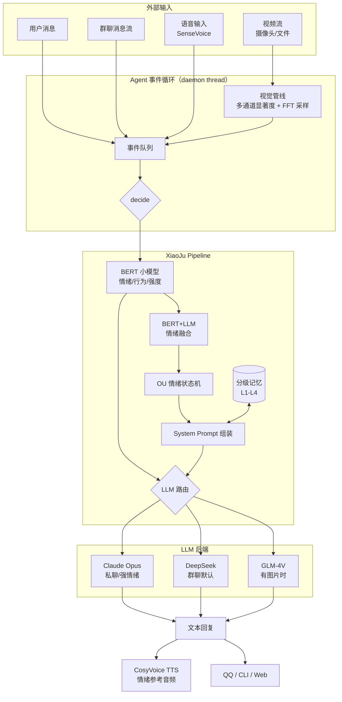

<div align="center">

# 🍊 XiaoJu — An Open AI Companion with Continuous Emotion Dynamics

**一个具有连续情绪动力学、分级记忆与多模态感知的 AI 伙伴系统**

*An open, research-oriented AI companion with continuous emotion dynamics, hierarchical memory, and multi-modal perception.*

[](./LICENSE)
[](https://www.python.org/)
[](https://pytorch.org/)
[]()

[快速开始](#-quick-start) · [设计文档](./project_src/docs) · [路线图](#-roadmap) · [English](#english-summary)

</div>

---

## ✨ 本项目的特殊亮点：

许多中小型AI Companion项目是 LLM prompt + TTS 的包装。本项目尝试回答一个更底层的问题：**如何让 AI 伙伴的情绪、记忆、感知有可验证的数学结构，而不是纯 prompt 工程。**

| 子系统 | 别的项目通常做法 | 本项目的做法 |
|---|---|---|
| 情绪 | LLM 自描述 / 离散标签切换 | **二维 Ornstein-Uhlenbeck 随机过程**，EKF 参数辨识，连续 (valence, arousal) 状态 |
| 记忆 | 全量塞 context / 简单 RAG | **L1-L4 分级**：原文 → 结构化状态 → Qdrant 向量 → 知识库 |
| 情绪分类 | 纯 LLM / 纯小模型 | **BERT + LLM softmax 融合**，reliability 加权 + 置信度门控 |
| 视觉 | 每帧喂多模态大模型 | **本地多通道显著度检测 + FFT 自适应采样**，事件触发云端分析 |
| 对话质量 | 单模型 | **三路 LLM 路由**（Claude / DeepSeek / GLM-4V），按场景和成本选模 |

核心设计全部有 [设计文档](./project_src/docs) 支撑，不是玄学。

---

## 🎯 核心特性

- 🧠 **OU 情绪状态机** — 二维耦合随机微分方程 + tanh 非线性，人格基线作不动点，EKF-MLE 参数辨识
- 💾 **分级记忆** — 工作记忆 / 会话摘要 / 长期向量 / 知识库，跨 session 语义召回
- 🎭 **BERT-LLM 情绪融合** — 小模型快速分类 + 大模型精判，softmax 融合自动拦截分歧时的错误指令
- 👁️ **动态视觉感知** — OpenCV 多通道显著度 + FFT 频域驱动的自适应采样（静态 2fps、活跃 15fps）
- 🔀 **多模型智能路由** — 图片→GLM-4V，私聊→Claude，群聊默认→DeepSeek，按情绪强度自动升级
- 🤖 **Agent 事件循环** — 不是请求-响应，而是持续运行的循环，支持主动发言、时间感知
- 🗣️ **语音交互** — CosyVoice zero-shot 音色克隆 TTS + SenseVoice 带情感识别的 ASR
- 📱 **QQ 机器人** — OneBot v11 WebSocket，私聊/群聊/图片，已生产可用

---

## 🏗 架构



完整子系统说明见 [`project_src/docs/`](./project_src/docs)。

---

## 🚀 Quick Start

### 最小可运行（仅对话）

```bash
git clone https://github.com/Orange20000922/MyNeuroLikeSystem.git
cd MyNeuroLikeSystem/project_src

# 基础依赖（~500MB）
pip install -r requirements.txt

# 配置 API key
cp config.json.example config.json
# 编辑 config.json，填入任一 LLM 的 api_key 即可：
#   - anthropic (Claude)
#   - deepseek
#   - custom (GLM / OpenAI 兼容)

# 跑一个 ping
python src/tools/quick_test.py --ping

# 交互式对话
python src/tools/quick_test.py --msg "你好"
```

### 可选模块

```bash
# 语音（TTS + ASR，~3GB 模型）
pip install cosyvoice funasr

# 视觉（摄像头/视频事件检测）
pip install opencv-python scikit-image

# QQ 机器人（需 NapCat）
pip install websockets pillow
python run_qq_bot.py
```

---

## 💬 对话示例

真实运行日志（Claude Opus + OU 状态机开启）：

```
[第 1 轮]
用户：今天项目被领导批评了，感觉好累
BERT：sadness (0.72) | intensity=0.58
OU：v=-0.24 a=+0.12 → "（只是淡淡的）。刚刚情绪发生了转变"
小橘：诶，被批评真的很让人泄气……你愿意说说是哪块出问题了吗？

[第 5 轮]  # 持续低落
用户：感觉自己什么都做不好
BERT：sadness (0.81)
OU：v=-0.51 a=+0.04 → "（情绪比较强烈），继续低落。这种状态已经持续了一段时间"
小橘：你已经连着说了好几句自我否定的话了——我听得有点担心。咱们别用一次批评
      去定义你整个人好吗？先说说今天吃饭了没？

[第 7 轮]  # 开始好转
用户：谢谢，听你说完感觉好多了
BERT：tenderness (0.64)
OU：v=-0.18 a=+0.21 → "情绪正在慢慢好转。刚刚发生了转变"
小橘：能好起来就好呀！慢慢来，我一直都在。
```

注意情绪回复不是 BERT 标签直接映射，而是 **状态机连续状态 → 动态 prompt hint → LLM 自然生成**。

---

## 📂 项目结构

```
MyNeuroLikeSystem/
├── project_src/
│   ├── config.json              # 主配置（API / 人格 / 记忆 / 视觉 / 音频）
│   ├── configs/                 # 配置加载与数据类
│   ├── src/
│   │   ├── core/                # Pipeline / Persona / OU 状态机 / 情绪融合
│   │   ├── agent/               # Agent 事件循环
│   │   ├── memory/              # L1-L4 分级记忆
│   │   ├── vision/              # 视觉感知（检测 / 采样 / 分析）
│   │   ├── media/               # TTS / ASR / 图片处理
│   │   ├── llm/                 # 多提供商 LLM 客户端
│   │   ├── adapters/            # QQ 机器人适配
│   │   └── attention/           # 群聊注意力追踪
│   ├── models/                  # BERT 联合模型（情绪 / 行为 / 强度）
│   ├── docs/                    # 设计文档（⭐️ 看这里了解原理）
│   └── requirements.txt
├── .github/workflows/ci.yml     # CI：语法检查 + 轻量单元测试
└── README.md
```

---

## 🧪 核心数学

### OU 情绪状态机

二维耦合 Ornstein-Uhlenbeck 过程，Euler-Maruyama 离散化：

$$
\begin{aligned}
v_{t+1} &= \tanh\bigl(\varphi_v v_t + \theta_v \mu_v + \kappa(a_t - \mu_a) + \beta \cdot \text{ai}_v + \gamma \cdot \text{user}_v + \varepsilon_v\bigr) \\
a_{t+1} &= \tanh\bigl(\varphi_a a_t + \theta_a \mu_a + \kappa(v_t - \mu_v) + \beta \cdot \text{ai}_a + \gamma \cdot \text{user}_a + \varepsilon_a\bigr)
\end{aligned}
$$

- 零输入不动点 $= (\mu_v, \mu_a)$（人格基线）
- 状态转移矩阵特征值 $|\lambda| < 1$ → 全局渐近稳定
- $\gamma$ 由 **EKF 最大似然估计**从真实对话数据辨识
- Negativity bias：$v < \mu_v$ 时均值回归率减半（Baumeister et al. 2001）

详见 [`docs/changelog_2026-03-09.md`](./project_src/docs/changelog_2026-03-09.md)

### BERT + LLM 融合

$$
z_i = w_{\text{bert}} \cdot p_i^{\text{bert}} \cdot \rho_i + w_{\text{llm}} \cdot p_i^{\text{llm}} + b, \quad \text{scores} = \text{softmax}(z)
$$

$\rho_i$ 是每个情绪标签独立的 reliability（基于验证集 F1）。一致时置信度叠加，分歧时 softmax 自动分散概率，门控拦截错误注入。

### FFT 自适应采样

$$
fps_{\text{target}} = fps_{\min} + (fps_{\max} - fps_{\min}) \cdot R_{\text{high}}^{\gamma}
$$

其中 $R_{\text{high}}$ 是显著度时序信号 STFT 频谱的高频能量占比。另加瞬时突变 spike guard，解决 FFT 窗口滞后问题。详见 [`docs/changelog_2026-04-17.md`](./project_src/docs/changelog_2026-04-17.md)。

---

## 🗺 Roadmap

- [x] OU 情绪状态机 + EKF 参数辨识
- [x] BERT + LLM 情绪融合
- [x] L1-L4 分级记忆（Mem0 + Qdrant）
- [x] Agent 事件循环（主动发言、时间感知）
- [x] QQ 机器人（私聊 / 群聊 / 图片）
- [x] 三路 LLM 路由（Claude / DeepSeek / GLM-4V）
- [x] 动态视觉感知（多通道显著度 + GLM-4V）
- [x] FFT 自适应帧采样
- [ ] CosyVoice / SenseVoice 集成到 AgentLoop 主循环
- [ ] Live2D 渲染 + 口型同步
- [ ] 个人博客看板娘前端
- [ ] 本地 LLM 替代（Qwen2-7B 蒸馏）

---

## ⚠️ 项目定位与免责

- 这是一个 **实验性研究项目**，非生产框架。很多模块为可验证设计选择而存在，未必是工程最优解。
- 灵感来源于 Neuro-sama，感谢 [Vedal987](https://www.twitch.tv/vedal987) 的创造。**本项目与 Neuro-sama 及其创作者无任何官方关联，非商业用途。**
- 配置中示例的 Claude / DeepSeek / GLM 模型名仅为作者使用的版本，使用前请确认你的 API 订阅。

---

## 🛠 硬件参考

| 场景 | GPU | RAM | 备注 |
|---|---|---|---|
| 纯推理（BERT + API LLM） | CPU 即可 / 4GB VRAM | 8GB+ | BERT ~15ms/条 |
| 本地训练 BERT | 8GB VRAM (RTX 3060) | 16GB | `--low_vram` |
| + CosyVoice TTS | 12GB+ VRAM | 32GB | Zero-shot 推理 |
| + SenseVoice ASR | 共用 TTS GPU 即可 | - | - |

---

## 🤝 贡献

欢迎 Issue 讨论设计和 bug。PR 前建议先开 Issue 对齐方向，因为很多模块有专门的设计文档和数学假设，直接改容易破坏不变量。

---

## 📜 License

[MIT License](./LICENSE) — 你可以自由使用、修改、商用，保留版权声明即可。

---

## English Summary

**XiaoJu** is an experimental AI companion system exploring whether emotion, memory, and perception in conversational AI can be built on verifiable mathematical structure rather than pure prompt engineering.

- **Emotion** is a 2D coupled Ornstein-Uhlenbeck process with personality baseline as fixed point, parameters identified via EKF-MLE.
- **Memory** is four-tier (working / session / vector / knowledge) with cross-session semantic recall.
- **Emotion classification** fuses a local BERT head with LLM softmax via reliability-weighted gating.
- **Vision** uses multi-channel saliency detection with FFT-driven adaptive sampling (2–15 fps).
- **LLM routing** dispatches among Claude / DeepSeek / GLM-4V based on chat mode and emotion intensity.

All design choices are documented in [`project_src/docs/`](./project_src/docs). Inspired by Neuro-sama (not affiliated).

---

<div align="center">

*如果这个项目对你有启发，欢迎 ⭐️ Star · 有问题欢迎 Issue*

</div>
